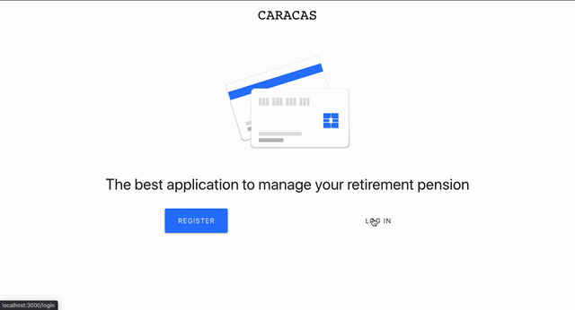

# Caracas Test



This project uses the following technologies:

- [React](https://reactjs.org) and [Redux](https://redux.js.org/basics/usagewithreact) for the frontend
- [Express](http://expressjs.com/) and [Node](https://nodejs.org/en/) for the backend
- [MongoDB](https://www.mongodb.com/) for the database
- [Plaid](https://plaid.com) for bank account linkage and transaction data

## I bootstappred Caracas Test in following this article, on Medium

- [Build a Full Stack Banking Web App with Plaid & the MERN Stack](https://medium.com/@rishipr/build-a-fullstack-banking-web-app-with-plaid-the-mern-stack-508914ce5694)

## Quick Start to test the demo

```javascript
// First
git clone https://github.com/giuliano2014/caracas-test.git

// Second
cd caracas-test

// Create 2 .env files with the following CLI
touch .env client/.env
send me an email (g.furgol@gmail.com), so that I can give you the variables to copy/paste in your .env files

// Install dependencies for server & client
npm install && npm run client-install

// Run client & server with concurrently
npm run dev

// If you have this kind of error => Error: listen EADDRINUSE :::5000, copy/paste the following CLI
killall -9 node
ps ax
npm run dev

// Client runs on http://localhost:3000 and server on http://localhost:5000
```
